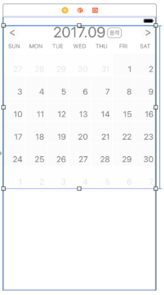
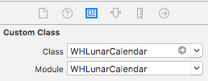

# WHLunarCalendar

[](http://cocoapods.org/pods/WHLunarCalendar)
[](http://cocoapods.org/pods/WHLunarCalendar)
[](http://cocoapods.org/pods/WHLunarCalendar)

## Example

To run the example project, clone the repo, and run `pod install` from the Example directory first.

## Installation

WHLunarCalendar is available through [CocoaPods](http://cocoapods.org). To install
it, simply add the following line to your Podfile:

```ruby
pod 'WHLunarCalendar', :git => 'https://github.com/KimWooHyun/WHLunarCalendar.git', :branch => 'master'
```

## Usage

Use storyboard

1.  
2. 
3. Import WHLunarCalendar & add delegate

```swift
ViewController.swift

import UIKit
import WHLunarCalendar

class ViewController: UIViewController {
    @IBOutlet weak var lunarCalendar: WHLunarCalendar!

    override func viewDidLoad() {
        super.viewDidLoad()
        self.lunarCalendar.delegate = self
    }
}
```

4. Add event

```swift
Extension

extension ViewController: LunarCalendarDelegate{
    func lunarCalendarCellClick(_ collectionView: UICollectionView, didSelectItemAt indexPath: IndexPath) {
        let cell = collectionView.cellForItem(at: indexPath) as! WHLunarCalendarCell
        print(cell.solorDay)
        print(cell.lunarDay)    // Optional
        print(cell.isLeap)      // Optional
    }
}
```


## Author

kimwoohyun, dngus242@gmail.com

## License

WHLunarCalendar is available under the MIT license. See the LICENSE file for more info.
